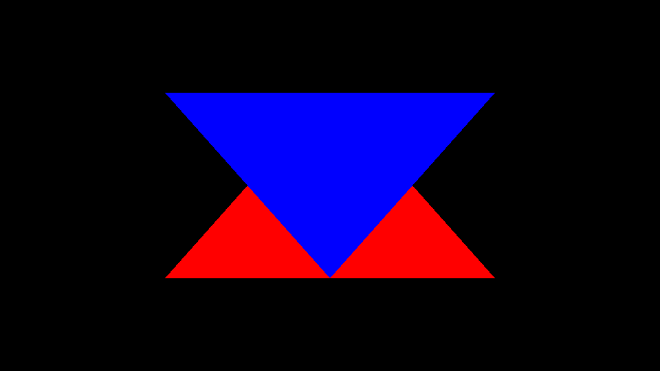
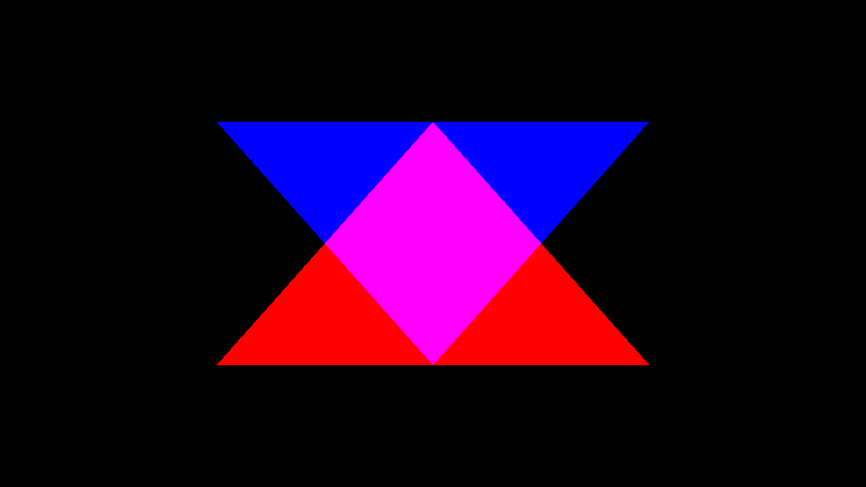
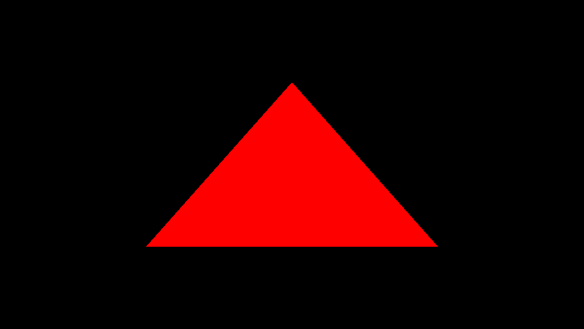
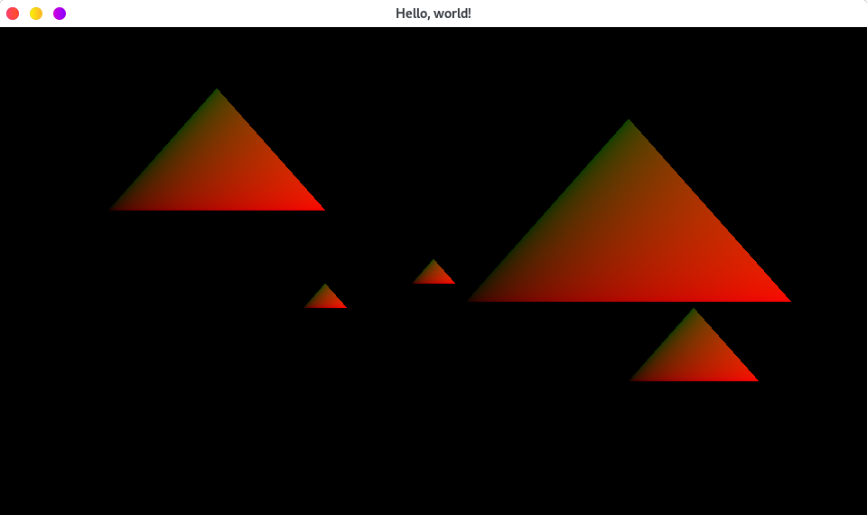

# luminance examples

This directory holds several examples you can use to learn how to use luminance. They are sorted
following a specific order that will help you learn from basics to more advanced features.

Each example comes in with a few explanations and how to use them at the top of the `_.rs` file.
A [common](./common/mod.rs) module is present so that the code can be shared and referenced from
all examples.

If you think a specific feature is missing, feel free to open a PR and add new examples!

> Have fun!

## [01 — Hello World](./01-hello-world.rs)

Learn how to draw two colored triangles by using vertex colors (comes in *direct* and *indexed*
geometry versions).

## [02 — Render State](./02-render-state.rs)

Learn how to change the render state to tweak the way primitives are rendered or how fragment
blending happens.

## [03 — Sliced Tessellation](./03-sliced-tess.rs)

Learn how to slice a single GPU geometry to dynamically select contiguous regions of it to render!

## [04 — Shader Uniforms](./04-shader-uniforms.rs)

Send colors and position information to the GPU to add interaction with a simple yet colorful
triangle!

## [05 — Attributeless Render](./05-attributeless.rs)

Render a triangle without sending any vertex data to the GPU!

## [06 — Texture](./06-texture.rs)

Learn how to use a loaded image as a luminance texture on the GPU!

## [07 — Offscreen](./07-offscreen.rs)

Get introduced to *offscreen rendering*, a powerful technique used to render frames into memory
without directly displaying them on your screen. Offscreen framebuffers can be seen as a
generalization of your screen.

## [08 — Shader Uniforms Adapt](./08-shader-uniforms-adapt.rs)

Learn how to change the type of a shader program’s uniform interface on the fly.

## [09 — Dynamic Uniform Interface](./09-dynamic-uniform-interface.rs)

Implement a dynamic lookup for shader program the easy way by using program interfaces to query
uniforms on the fly!

## [10 — Vertex Instancing](./10-vertex-instancing.rs)

Learn how to implement a famous technique known as _vertex instancing_, allowing to render multiple
instances of the same object, each instances having their own properties.

